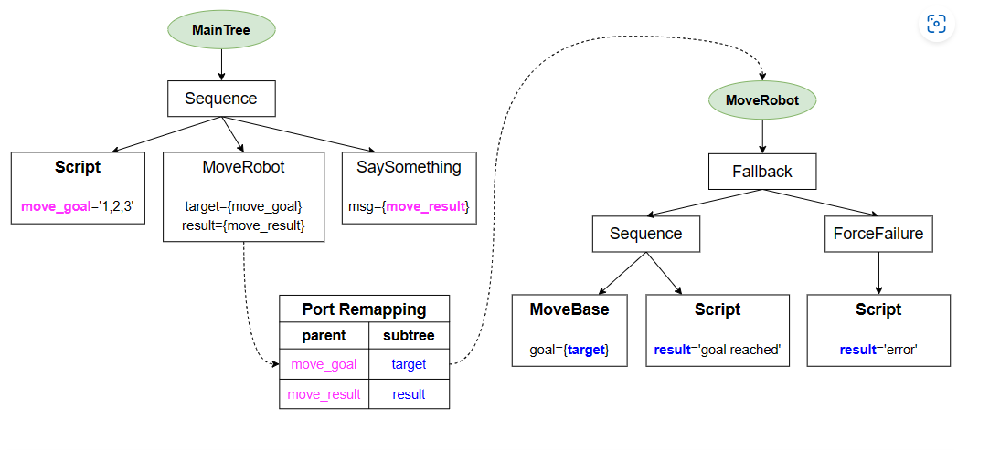

# 行为树学习

[toc]


## 编译

Windows 下

编译 behaviorTree 库 选择指定编译配置文件  conan 参数--pr0file

```
【behaviorTree】
1.conan安装依赖库时，电脑有多个编译器
解决：修改配置文件conan profile path default:

[settings]
arch=x86_64
build_type=Release
os=Windows
compiler=msvc
compiler.cppstd=17
compiler.version=193
compiler.runtime=dynamic

2.错误	C2001	常量中有换行符
解决：在引号前在一个空格   ,修改编码为utf8-bom

3.C++ 标准库中未解析的外部符号 __std_find_trivial_8
解决：升级到：VS2022 17.3.6以上版本

4.to_json不明确的符号
解决：加前缀nlohmann::
```


## 基础

### 行为树的创建

创建简单的树。

### 黑板和端口，用于数据传递

注册静态方法，实现动态时的输入输出


### 通用类型端口重载，实现自定义内容输出输入

重载 BT中的<>方法


### 异步操作  StatefulAction节点


### 端口重映射

主树和子树 黑板中的端口一样

```xml
<root BTCPP_format="4">

    <BehaviorTree ID="MainTree">
        <Sequence>
            <Script code=" move_goal='1;2;3' " />
            <SubTree ID="MoveRobot" target="{move_goal}" 
                                    result="{move_result}" />
            <SaySomething message="{move_result}"/>
        </Sequence>
    </BehaviorTree>

    <BehaviorTree ID="MoveRobot">
        <Fallback>
            <Sequence>
                <MoveBase  goal="{target}"/>
                <Script code=" result:='goal reached' " />
            </Sequence>
            <ForceFailure>
                <Script code=" result:='error' " />
            </ForceFailure>
        </Fallback>
    </BehaviorTree>

</root>
```

xml如上




### 使用多个XML文件

1.代码实现

手动加载多个文件，`fac.registerBehaviorTreeFromFile(path)`

2.xml文件实现

在xml文件中添加

```xml
<root BTCPP_format="4">
    <include path="./subtree_A.xml" />
    <include path="./subtree_B.xml" />
    <BehaviorTree ID="MainTree">
        <Sequence>
            <SaySomething message="starting MainTree" />
            <SubTree ID="SubTreeA" />
            <SubTree ID="SubTreeB" />
        </Sequence>
    </BehaviorTree>
<root>
```


### 初始化和传参

1.使用默认构造函数在初始化时候就传入参数

```
Action_A(const std::string& name, const NodeConfig& config,
             int arg_int, std::string arg_str):
        SyncActionNode(name, config),
        _arg1(arg_int),
        _arg2(arg_str) {}
```


2.使用判断，当node初始化时候，调用init函数

```
void initialize(int arg_int, const std::string& arg_str)
    {
        _arg1 = arg_int;
        _arg2 = arg_str;
    }
    
    
auto visitor = [](TreeNode* node)
{
  if (auto action_B_node = dynamic_cast<Action_B*>(node))
  {
    action_B_node->initialize(69, "interesting_value");
  }
};

// Apply the visitor to ALL the nodes of the tree
tree.applyVisitor(visitor);
```


### 脚本和前提条件

xml如下

```xml
<root BTCPP_format="4">
  <BehaviorTree>
    <Sequence>
      <Script code=" msg:='hello world' " />
      <Script code=" A:=THE_ANSWER; B:=3.14; color:=RED " />
        <Precondition if="A>B && color != BLUE" else="FAILURE">
          <Sequence>
            <SaySomething message="{A}"/>
            <SaySomething message="{B}"/>
            <SaySomething message="{msg}"/>
            <SaySomething message="{color}"/>
        </Sequence>
      </Precondition>
    </Sequence>
  </BehaviorTree>
</root>
```


## 参考资料

[Youbot 示例教程 |机器人和人工智能中的行为树 (btirai.github.io)](https://btirai.github.io/youbot)